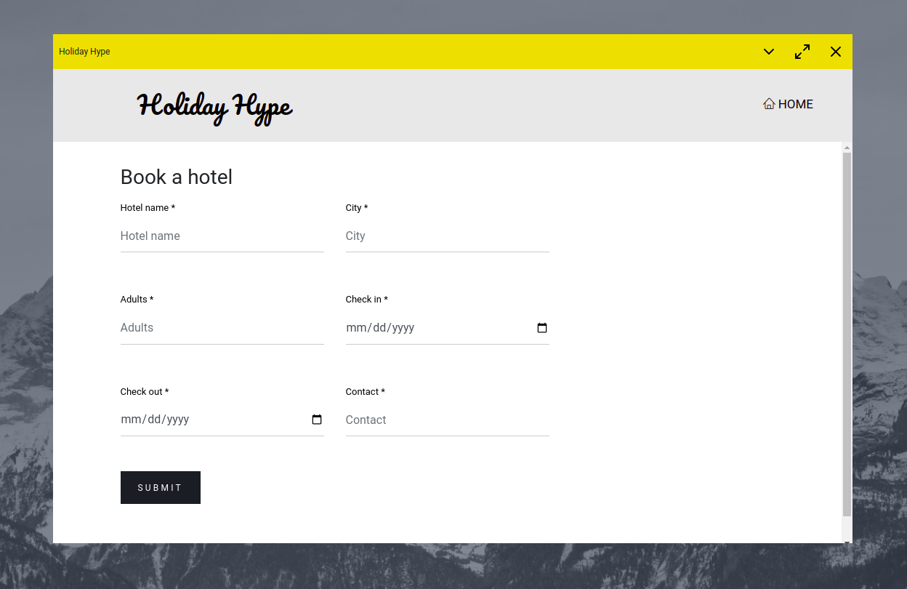
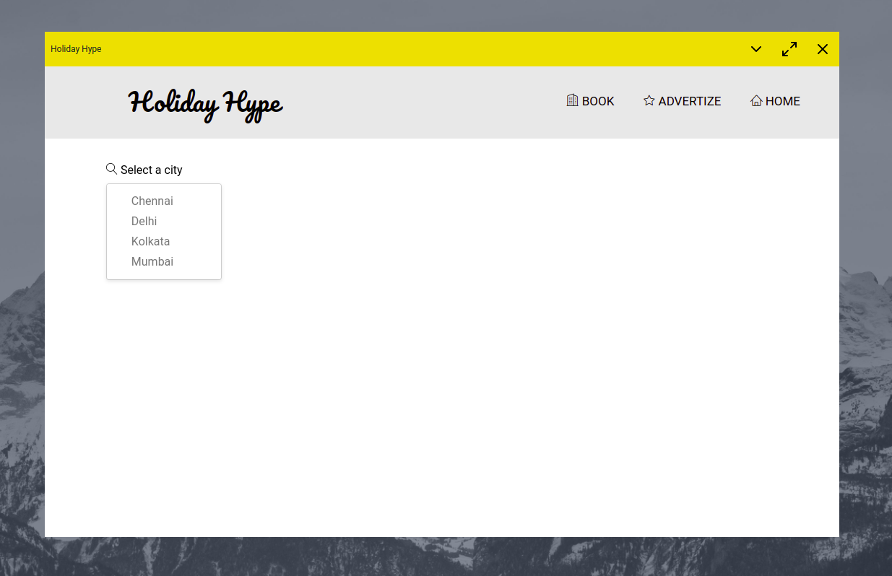
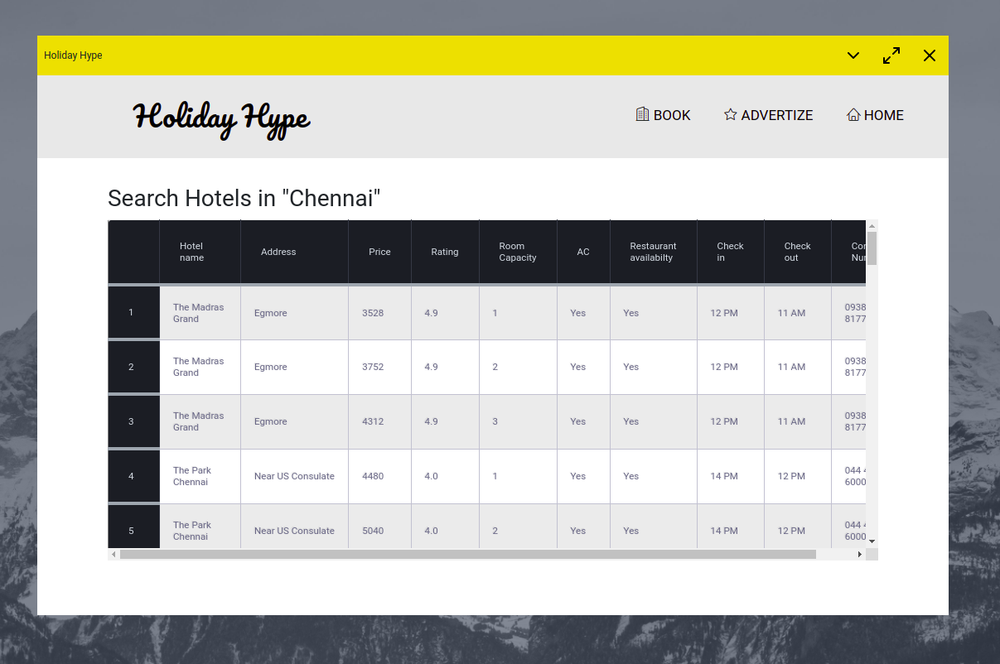

# Holiday Hype

[Skip to Installation](https://github.com/Mayooonaiselol/Holiday-Hype/tree/master#install)

Holiday Hype is a electron app which utilizes python's libraries and uses csv files to store data. It is made on the topic "hotel booking".

We have to select a city in order to book a hotel, and then click on book hotel to book the hotel in the city we have selected and then fill the form.

We can also advertize a hotel by selecting a city and clicking on advertize, and then filling the form.

## Showcase







## Install

**Important Note!**

Replace all occurances of `process.resourcesPath` by `__dirname` in `main.js` file to run the app without packaging it.
If you have to package the app, leave main.js as it is.
In short, replacing will make the command `npm start` work.

Clone this repository and enter the directory:

```bash
git clone https://github.com/Mayooonaiselol/Holiday-Hype.git
cd Holiday-Hype
```

Install node modules:

```bash
npm install
```

Assuming you read the note, to run the app:

```bash
npm start
```

To package the app for linux and windows:

```bash
npm run make
```

## Why Electron?

Electron is a free and open-source software framework, it is designed to create desktop applications using web technologies which are rendered using a flavor of the Chromium browser engine, and a backend using the Node.js runtime environment. In general, I find it easier to make a good UI design (since CSS stylesheets make designing very easy), so I chose Electron.

If you are planning to make a electron app, you can ask at the Electron Discord Server, or read the Electron docs.
